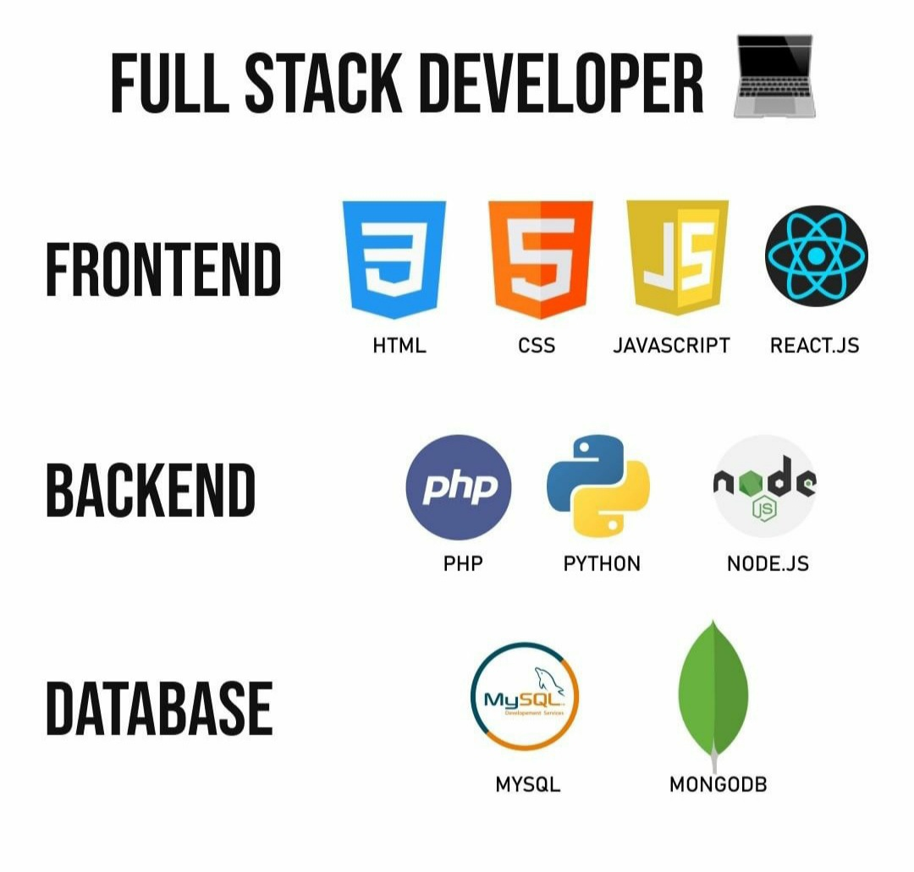

<h1 align="center">Olá 👋, Meu Nome Jose Isaias</h1>
<h3 align="center">Apaxoinado Por Programaçao Full Stack Dev</h3>

- 🔭 Atualmente Estudo Programaçao **Controle de Estoque**

- 👯 Projeto javascript [Modelo 1](https://contaapagaratualizadahtml.josesilva29.repl.co/)

- 🤝 Projeto Estoque [Estoque](https://controleprodutos.josesilva29.repl.co/)

- 👨‍💻 Meu Portfolio [https://jisaiaslima35.github.io/#](https://jisaiaslima35.github.io/#)

- 📫 Meu Email **isaiassilva356@gmail.com**

<h3 align="left">Connect with me:</h3>

<h3 align="left">Languages and Tools:</h3>

              

#############################################################################################################################

  

   

<h1>QUEM SOU EU ?</h1>
# "👋 Olá! Sou um estudante de desenvolvimento Full Stack apaixonado por Python, JavaScript, SQL e PHP. Atualmente, estou mergulhando fundo na arte de criar aplicativos web incríveis e elegantes. Estou em busca constante de aprendizado e aprimoramento, buscando soluções inovadoras para desafios complexos. Vamos codar juntos e criar um impacto positivo no mundo da tecnologia! 💻🚀"

<h1>TENHO ALGUNS PROJETOS CONCLUIDOS E VARIOS E DESENVOLVIMENTO</h1>
<ul>
  <li>CLINICA ODOTONLOGICA</li>
  <li>ESCOLA ESTADUAL</li>
  <li>TODOLIST</li>
  <li>CONSUMINDO API COM REACT</li>
  <li>VARIOS PROJETOS PYTHON</li>
</ul>

